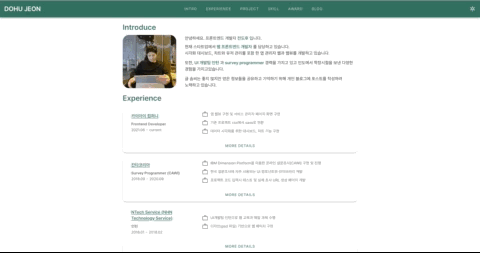

# Dohu's Portfolio

<!-- TABLE OF CONTENTS -->

  
Table of Contents

  <ol>
    <li><a href="#about-the-project">About the project</a></li>
    <li><a href="#url">URL</a></li>
    <li><a href="#support">Support</a></li>
    <li><a href="#skill-set">Skill set</a></li>
    <li><a href="#license">License</a></li>
  </ol>

<!-- ABOUT THE PROJECT -->
## About The Project
PortFolio website made with Vue

## URL
https://adc0612.github.io/portfolio/

## Support
* Mobile, Tablet, PC
* Dark mode
* English Translation

## Skill Set
* Javascript
* Vue 2
* Vuetify
* Sass

## License
Distributed under the MIT License. See `LICENSE` for more information.
